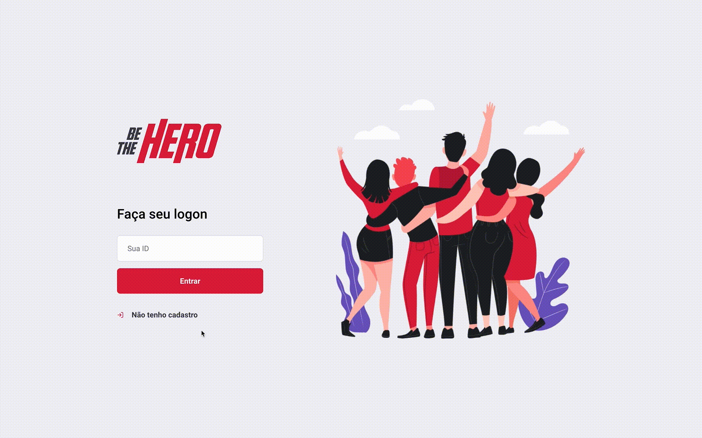

# About
**NGO funding and incident reporting.**

This project was built to help NGOs report cases and causes that require funding. It provides a web interface that enables a Non-governmental organization to authenticate, create new incidents with detailed description and set a funding goal for each case.

It also provides a mobile app for donors, where all pending incidents from all registered NGOs are listed and can be accessed for further details. To donate, the user must contact the NGO via the provided contact details (e-mail or Whatsapp).

**Built with:** Node.js, Express.Js, ReactJS, Knex.js, SQLite, React Native and Expo.

# Features
- 😊 NGO signup
- 🆘 Incident report registration with needed funds
- 🤝 Contact NGOs via email or whatsapp and donate

## Web App


## iOS/Android App
<p align="center">
  
</p>

# Running Locally

## Starting Backend
```sh
cd backend && yarn
yarn knex:migrate
yarn dev
```

## Web interface
```sh
cd frontend && yarn
yarn start
```
Access http://localhost:3000

## Mobile

### iOS
```sh
cd mobile && yarn
npx pod-install ios
yarn ios
```

### Android
```sh
cd mobile && yarn
yarn android
```
Access http://localhost:19002 and choose target device (simulator or physical device)