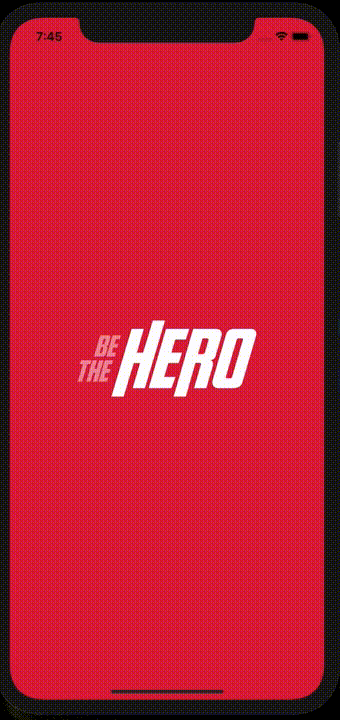

# Features
- 😊 NGO signup
- 🆘 Incident report registration with needed funds
- 🤝 Contact NGOs via email or whatsapp and donate

## Web App


## iOS/Android App
<p align="center">
  
</p>

# Running Locally

## Starting Backend
```
cd backend && yarn
yarn dev
```

## Web interface
```
cd frontend && yarn
yarn start
```
Access http://localhost:3000

## Mobile

### iOS
```
cd mobile && yarn
npx pod-install ios
yarn ios
```

### Android
```
cd mobile && yarn
yarn android
```
Access http://localhost:19002 and choose target device (simulator or physical device)